# Clean King Facility Management

(Developer: Morgan Asare)

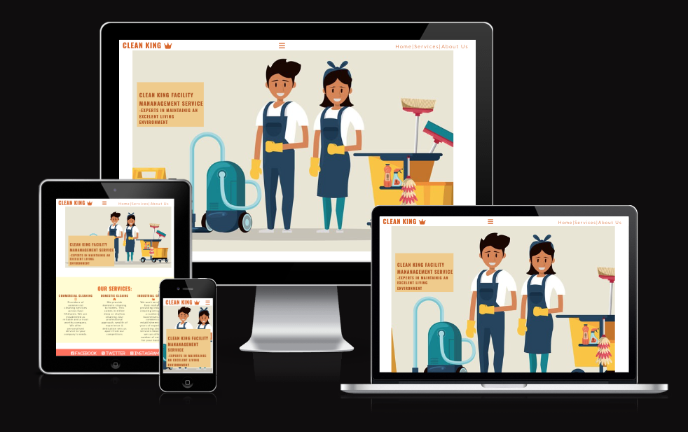

[Live webpage](https://cleanoak.github.io/clean-king/index.html)

## Table of Content

1. [Project Goals](#project-goals)
    1. [User Goals](#user-goals)
    2. [Site Owner Goals](#site-owner-goals)
2. [User Experience](#user-experience)
    1. [Target Audience](#target-audience)
    2. [User Requrements and Expectations](#user-requrements-and-expectations)
    3. [User Stories](#user-stories)
3. [Design](#design)
    1. [Design Choices](#design-choices)
    2. [Colour](#colours)
    3. [Fonts](#fonts)
    4. [Structure](#structure)
    5. [Wireframes](#wireframes)
4. [Technologies Used](#technologies-used)
    1. [Languages](#languages)
    2. [Frameworks & Tools](#frameworks-&-tools)
5. [Features](#features)
6. [Testing](#validation)
    1. [HTML Validation](#HTML-validation)
    2. [CSS Validation](#CSS-validation)
    3. [Accessibility](#accessibility)
    4. [Performance](#performance)
    5. [Device testing](#performing-tests-on-various-devices)
    6. [Browser compatibility](#browser-compatability)
    7. [Testing user stories](#testing-user-stories)
8. [Bugs](#Bugs)
9. [Deployment](#deployment)
10. [Credits](#credits)
11. [Acknowledgements](#acknowledgements)

## Project Goals

To help customers in the East Midlands have easy access to our services by finding about us on our website.

### User Goals
1. Finding a cleaning service available in the East Middlands. i.e. Leicestershire, Derby, Loughborough etc.
2. View a full description of the different services we provide
3. Find Contact information about Clean King
4. Find Social Network information about clean King
5. Book a service through the website

### Site Owner Goals
1. Boost engagement on the website
2. Promote business presence online
3. Increase revenue
4. Provide easy access of information

## User Experience

### Target Customers
1. Customers who want their homes to be cleaned on special occasions and regularly
2. Businesses who need their facility managed by experts
3. Big Industries like warehouses and factories

### User Requrements and Expectations

1. An easy to use website with navigation system
2. Acceible on all web browsers
3. Easy to find information about our services
4. Very intuitive
5. Excellent and consistent page layouts

### User Stories

#### New-to-the-page

- As a new user, I want to find the type of service I need
- As a new user, I want to find the location of the company
- As a new user, I want to easily contact the company
- As a new user, I want to easily book a service

#### Regular or Returning User

- As a regular or returning user, I wasnt to easily find the services I need
- As a regular or returning user, I want to easy contact the company 
- As a regular or returning user, I want to easily book a service
- As a regular or returning user, I need a direction to the location

#### Site Owner

- As the site owner, I want to boost user engagement on the website
- As a site owner, I want users to find information easily
- As a site owner, i want users to easily navigate on the each page
- As a site owner, I want users to book our services easily on the page

## Design

The website was designed with the customer in mind. We selected vibrant colours to engage the customer and
boost usage

### Colour

For the colours I chose burnt orange, light orange, cream and white to match the company logo.

### Fonts

Lato, sanserif was used for the main logo and most of the paragraphs. Roboto, San serif was used for the 
About page heading.

### Structure

The website is structured in  a simplistic way to make it highly user friendly and enjoyable to use.

The website consists of three pages:

- Home page
- Services page
- About page
- A footer

### Wireframes

Home

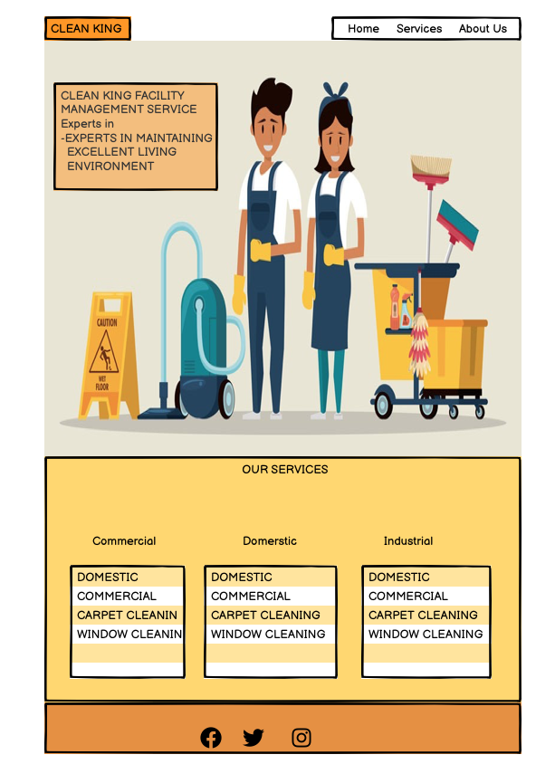

Services

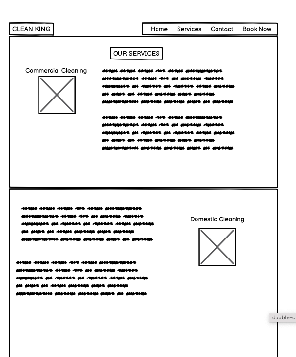

About Us

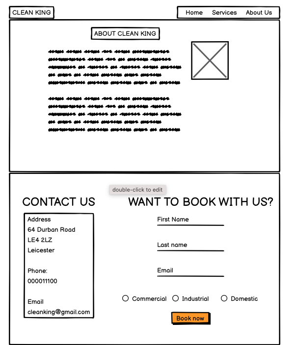

## Technologies Used

### Languages
- HTML
- CSS

### Frameworks & Tools
- Git
- GitHub
- Balsamic
- Google Fonts
- Font Awesome
- Favicon
- ui.dev

## features 

This page has three pages and eight other features

### Logo and navigation bar
- This has all three pages
- The navbar is fully responsive and changes to a toggler. this links all pages.
the toggler transforms to a hamburger menu on small screens
- This allows users to navigate the page easily
- Users are able to locate other pages on the website 

logo

### Footer
the footer features our social media network handles. This is also available on all pages

- This allows users to easily find more about the company on their social network 

footer

### Services page
The service page provides information about the differnt types of services provided by Clean King

- Domestic Cleaning
- Commercial Cleaning
- industrial cleaning
- This helps users to find information on what services are provided
- Allows users to make quick decisions on what they want

services

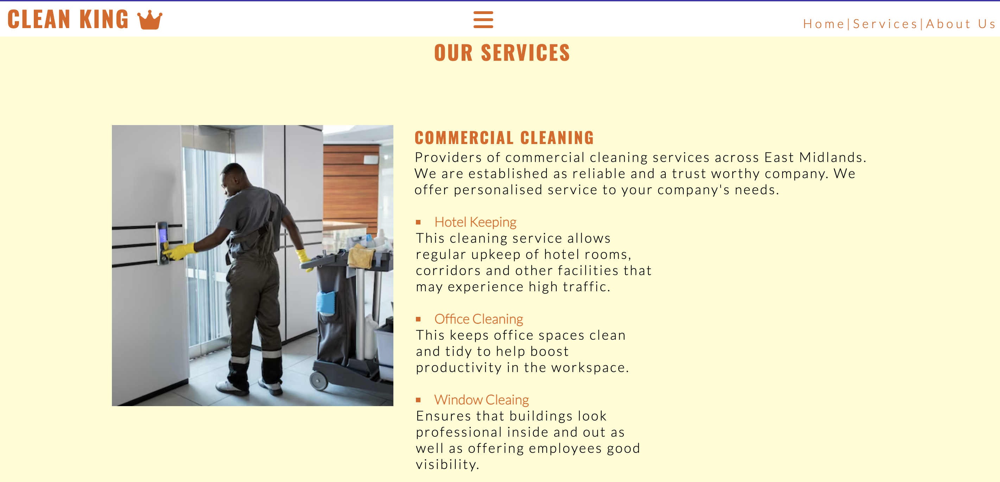

### About US Page
About Us page features information on the companies goals and mission. Also it has the contact
information and a booking form.

- This gives users a brief summary about what the company is about

about us

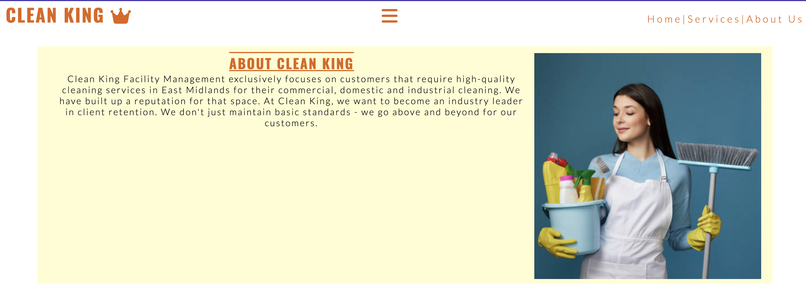

### Contact Section
The contact section has all the various forms where users can reach the company
 
- Physical Address
- Phone
- Email
- Opening and Closing information
- Map for direction

- Users are able to find the location of the company
- Users are able to contact the company by the information provided

contact

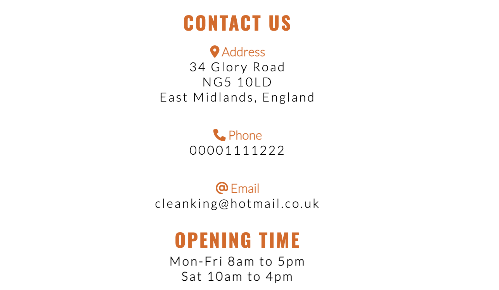

### Booking Form
The booking form also allows customers to book any typle of services from the optioins in the radio buttons.

- Users are able to book a service on the go
- Users are able to easily select what type of service they need

book

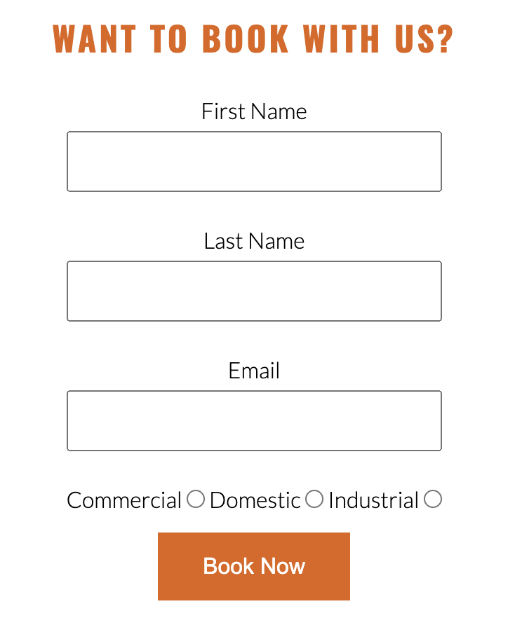

### Radio buttons

This has a simple select option to help users make a decision

- This helps users to select the type of service they want 

rodio button

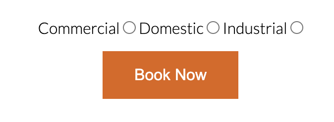

### Map

Direction to the address can be accessed by a simple click on the map

- Users are able to locate the company easily

map

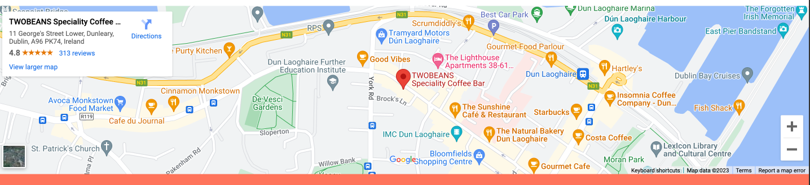

## Validation

### HTML Validation

The html pages for this website was validated using [Nu Html Check](https://validator.w3.org/nu/) and no errors were found. 

* [Home page](https://validator.w3.org/nu/?doc=https%3A%2F%2Fcleanoak.github.io%2Fclean-king%2Findex.html)
* [Services page](https://validator.w3.org/nu/?doc=https%3A%2F%2Fcleanoak.github.io%2Fclean-king%2Fservices.html)
* [About Us page](https://validator.w3.org/nu/?doc=https%3A%2F%2Fcleanoak.github.io%2Fclean-king%2Faboutus.html)
* [404 page](https://validator.w3.org/nu/?doc=https%3A%2F%2Fcleanoak.github.io%2Fclean-king%2F404.html)

### CSS Validation

The stylesheet for this website was validated using the W3C [Jigsaw](https://jigsaw.w3.org/css-validator/) CSS validation service. The file contained no errors.
* [CSS Validation](https://jigsaw.w3.org/css-validator/validator)

### Accessibility 

The accessibility test was done with Wave Accessibility Evolution tool. All the test passed.

* [Home page](https://wave.webaim.org/report#/https://cleanoak.github.io/clean-king/index.html)
* [Services page](https://wave.webaim.org/report#/https://cleanoak.github.io/clean-king/services.html)
* [About Us page](https://wave.webaim.org/report#/https://cleanoak.github.io/clean-king/aboutus.html)
* [404 page](https://wave.webaim.org/report#/https://cleanoak.github.io/clean-king/abotus.html)

### Performance

Home

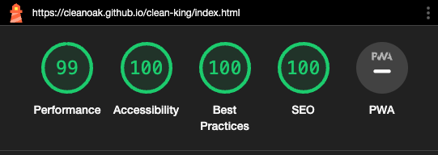

Services

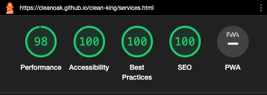

About Us

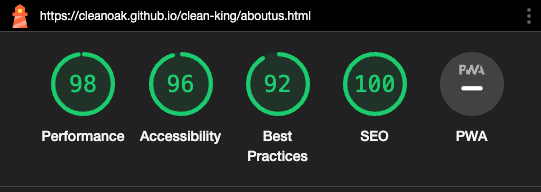

### Performing tests on various devices

## Deployment
This website was deployed using GitHub Pages by following below:
- Go to Githus and navigate to settings
- Select Pages form the left side of a list on the settings page
- Select main/ root under branch and save
- Provide a customised name for your website under the Custom domain section and save
- Your site is available on the top right side of the page
- click on visit site to launch your page 

## Credits

- [Background images](https://www.pexels.com/search/background/)
- [Colours](https://htmlcolorcodes.com/colors/light-orange/)
- [Website Informations](https://htmlcolorcodes.com/colors/light-orange/)
- [Istockphotos](https://htmlcolorcodes.com/colors/light-orange/)
- [UI Dev](https://theme.co/forum/t/footer-content-overlapping-with-main-content/73859)
- [HTML Validator](https://validator.w3.org/nu/)
- [CSS Validator](https://www.w3.org/)
- [Wave Web Accessibility](https://wave.webaim.org/)
- [Font Awesome](https://validator.w3.org/nu/)
- [Google Fonts](https://validator.w3.org/nu/)
- [W3 Schools](https://validator.w3.org/nu/)
- [Stack Overflow](https://validator.w3.org/nu/)

## Acknowledgements
My biggest gratitude goes to my wife who has supported me through out this project  
Also to the following;
- My mentor Mo Shami for his support and guidance
- To the new friends I have made on this course who encourage me to do more

